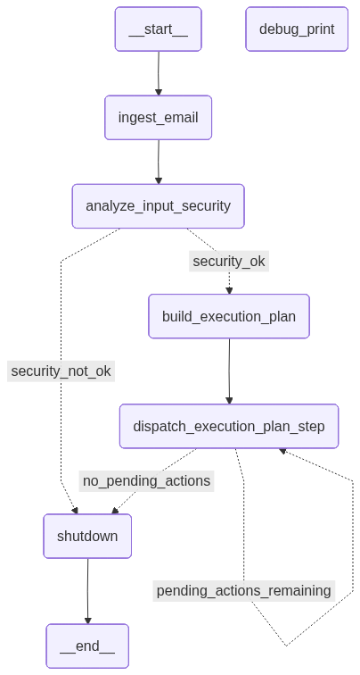
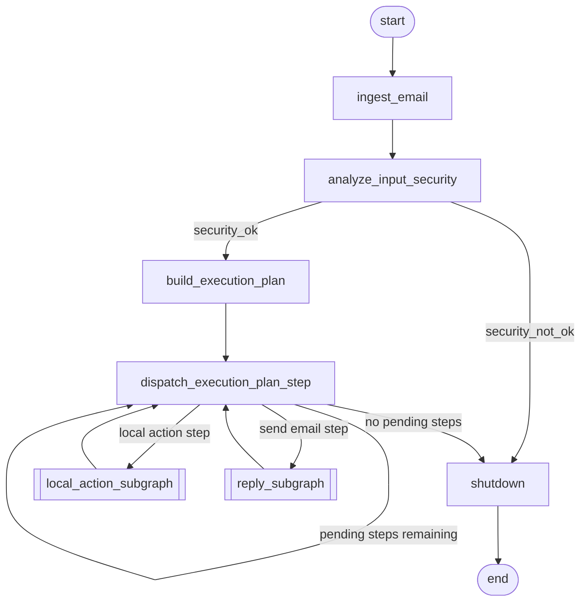

# AI Email Workflow Agent

A small Python prototype for handling email with an LLM in the loop. It pulls in an
email, runs a safety check on the input, asks a model to draft a structured plan of
what to do, and then walks through that plan one step at a time. Steps run inside
controlled subgraphs (local/browser actions and reply sending), and anything risky —
right now that means browser navigation — pauses for a human to approve it first.

Under the hood it leans on LangGraph for the stateful orchestration, Pydantic AI for
structured model output, Qdrant for a vector ingestion pipeline (the groundwork for a
future RAG layer), Playwright for browser automation, and SQLAlchemy/PostgreSQL with
Alembic for persistence. A Postgres-backed checkpointer ties it together so runs can
be paused and resumed.

This is a working proof of concept, not a finished product. Some pieces are solid,
others are stubs — the sections below try to be honest about which is which.

## Why I built it

I just wanted to control my laptop remotely via email and llm :)

## What's in here

Everything listed below actually exists in the code. I've noted where something is
still a stub.

- A Python backend laid out for AI workflows.
- LangGraph-style orchestration: one top-level graph plus two subgraphs.
- Structured plan building with Pydantic AI structured output types.
- A step-by-step execution loop driven by a typed plan.
- Gmail ingestion, with the email HTML normalized and cleaned.
- An input-safety classification node. The node and routing are wired up, but the
  classifier itself currently returns a stub `clean` verdict.
- A human-approval pause before risky browser actions, using LangChain's
  `HumanInTheLoopMiddleware` to interrupt on browser navigation.
- A local action layer — a bash executor and a Playwright browser executor — picked by
  an LLM capability selector.
- Reply sending through a Gmail-tool agent. For now this is a single `send_email`
  node; separate generation, risk-scoring and approval nodes are still on the list.
- Qdrant ingestion groundwork for RAG: chunking, BGE-M3 embeddings, and the upsert
  pipeline. The retrieval side isn't wired into the graph yet.
- PostgreSQL/SQLAlchemy/Alembic persistence.
- A Postgres-backed checkpointer so human-in-the-loop runs can resume.

## Architecture

Here's the top-level graph, rendered straight from the code:





The subgraphs are registered as nodes on the top-level graph, so they share the same
checkpointer. That's what lets human-in-the-loop resume work across an entire run
rather than just inside one subgraph.

- `local_action_subgraph`: `select_action_execution_capability` (the LLM picks bash or
  browser), then routes to `execute_bash_action` or `execute_browser_action`.
- `reply_subgraph`: a single `send_email` node for now.

## How a run goes

1. Ingest the email and parse the sender and snippet into a normalized model.
2. Classify the sender as internal or external and build the normalized email data.
3. Run the input-security analysis (a stub today).
4. If the input isn't acceptable, bail out through the `shutdown` node.
5. Ask the LLM for a structured plan of atomic steps.
6. Dispatch the next pending step.
7. If it's a local action, run the local-action subgraph (bash or browser) — browser
   navigation triggers the human-approval pause.
8. If it's a send-email step, run the reply subgraph.
9. Mark the step done and loop until nothing's pending.
10. Finish through `shutdown`.

## Tech stack

Straight from `pyproject.toml`:

- Python 3.12 (`>=3.12,<3.13`)
- LangGraph and `langgraph-checkpoint-postgres`
- LangChain plus `langchain-google-community` (Gmail toolkit), `langchain-openai`,
  `langchain-experimental`
- Pydantic AI (`pydantic-ai-slim`) and Pydantic / `pydantic-settings`
- Qdrant (`qdrant-client`) for the vector store
- FlagEmbedding (BGE-M3) for embeddings, `transformers<5`
- SQLAlchemy 2.x, Alembic, PostgreSQL via `psycopg[binary]` + `psycopg-pool`
- Playwright for browser automation
- `beautifulsoup4`, `lxml`, `readability-lxml` for cleaning email HTML
- `google-auth-oauthlib` for Gmail OAuth
- `structlog` is in the dependencies, but logging currently goes through the standard
  library `logging` module — structured logging isn't wired in yet.

## Layout

```
.
├── main.py                       # Example entry point: runs one event through the graph
├── docker-compose.yml            # Postgres + Qdrant + app services
├── alembic.ini                   # Alembic configuration
├── migrations/                   # Alembic environment and versioned migrations
├── diagram.png                   # Rendered top-level graph
└── src/
    ├── settings.py               # pydantic-settings configuration
    ├── utils.py                  # Small helpers (email parsing)
    ├── embedding_models/         # BGE-M3 embedding model loader
    ├── mail_agent/
    │   ├── runtime/              # Event model, event factory, GraphRuntime entry point
    │   ├── states/               # Top-level state and subgraph substates (Pydantic)
    │   ├── shared/               # Enums, shared models, prompts, exceptions
    │   ├── services/             # Plan builder, capability selector, Gmail services,
    │   │   └── local_action_executors/   # bash and browser executors
    │   └── graph/
    │       ├── top_level_graph/  # Nodes, routing, graph builder
    │       ├── local_action_subgraph/
    │       ├── reply_subgraph/
    │       └── persistence/      # Async Postgres checkpointer
    ├── services/vector/email/    # Email chunking and vectorization service
    ├── storage/
    │   ├── postgres/             # SQLAlchemy models, session, repositories
    │   └── qdrant/               # Qdrant client, bootstrap, repositories
    └── scripts/                  # Gmail import, HTML cleaning, PG -> Qdrant ingestion
```

## Local setup

Dependencies are managed with [uv](https://docs.astral.sh/uv/).

1. Install dependencies:
   ```bash
   uv sync
   ```
2. Install the Playwright browsers (the browser executor needs them):
   ```bash
   uv run playwright install chromium
   ```
3. Copy the env template and fill it in:
   ```bash
   cp .env.example .env
   ```
4. Bring up Postgres and Qdrant (and optionally the app) with Docker:
   ```bash
   docker compose up -d postgres qdrant
   ```
5. Apply the migrations:
   ```bash
   uv run alembic upgrade head
   ```
6. Create the Qdrant collection for email vectors:
   ```bash
   uv run python -m src.storage.qdrant.bootstrap
   ```

The Gmail features (`FetchEmailService`, the reply agent, the import script) need
Google OAuth credentials. Drop a `credentials.json` / `token.json` in locally — both
are git-ignored and should never be committed.

## Configuration

Config is loaded by `src/settings.py` (pydantic-settings). Copy `.env.example` to
`.env` and fill in the values. Use placeholders; don't commit real secrets.

| Variable | Purpose |
| --- | --- |
| `INTERNAL_EMAIL_ADDRESS` | Address treated as an internal sender |
| `OPENAI_API_KEY` | OpenAI API key for the LLM agents |
| `DEFAULT_MODEL` | Model name passed to the OpenAI-backed agents |
| `POSTGRES_DB` / `POSTGRES_USER` / `POSTGRES_PASSWORD` | Postgres credentials for Docker |
| `DATABASE_URL` | Postgres DSN (`postgresql://...`) |
| `QDRANT_HOST` / `QDRANT_REST_PORT` / `QDRANT_GRPC_PORT` | Qdrant connection |
| `QDRANT_PREFER_GRPC` / `QDRANT_CLIENT_TIMEOUT` | Qdrant client options |

## Common commands

Migrations (Alembic):
```bash
uv run alembic revision --autogenerate -m "name"   # or: make migrate name="name"
uv run alembic upgrade head                          # or: make upgrade
uv run alembic downgrade -1
```

Vector ingestion pipeline:
```bash
uv run python -m src.scripts.import_emails_to_db            # Gmail -> Postgres
uv run python -m src.scripts.clean_emails_in_pg            # normalize stored HTML
uv run python -m src.scripts.ingest_emails_from_pg_to_qdrant   # Postgres -> Qdrant
```

Run the example event end to end (uses a hardcoded sample message in `main.py`):
```bash
uv run python main.py
```

Handy while developing:
- Qdrant dashboard: http://localhost:6333/dashboard

One dependency gotcha: the project pins `pydantic-ai-slim` because the full
`pydantic-ai` wants `transformers >= 5`, while FlagEmbedding needs `transformers < 5`.

## Safety model

The whole design treats LLM output as untrusted and keeps execution under explicit
control:

- Plans and actions the model proposes are data, not commands — the graph decides what
  actually runs.
- An input-security node sits on the path as a control point and routes unsafe input to
  `shutdown`. (The classifier behind it is still a stub.)
- Risky browser actions (navigation) pause for human approval before they run.
- The Postgres checkpointer makes runs resumable, so a human decision can be asked for
  mid-flow and applied later.
- Still to come: a real input-security classifier, deterministic plan validation, reply
  review before sending, audit logging, evals, and tighter permissions around the
  bash/browser executors.

## Status

Prototype, work in progress.

Working:
- The full top-level graph: ingest, plan, dispatch loop, subgraph execution, shutdown.
- Structured plan building and capability selection via Pydantic AI.
- Bash and Playwright browser executors, with the human-approval pause on navigation.
- Gmail ingestion, HTML cleaning, and Postgres persistence with Alembic migrations.
- Postgres-backed checkpointer for resumable, human-in-the-loop runs.
- The Qdrant ingestion pipeline (chunk, embed with BGE-M3, upsert).

Not done yet:
- The input-security classifier is a stub that always returns `clean`.
- The reply subgraph only sends — no separate generation/risk/approval nodes.
- No RAG retrieval node yet; only the ingestion side exists.
- No automated tests.
- A few modules use inconsistent import paths, so running them may need the repo root
  on `PYTHONPATH`.

## Roadmap

- A RAG retrieval layer over ingested emails / local docs, wired in as a graph node.
- A real input-security classifier to replace the stub.
- A fuller reply subgraph: generation, risk scoring, and approval before sending.
- Deterministic execution-plan validators.
- Better tracing and structured logging (actually wire in `structlog`).
- Test coverage.
- A small CLI or UI demo.
- Sandboxed local execution and tighter permission boundaries.

## A note on scope

This is backend-heavy AI product engineering, not ML research. The interesting part
isn't training or fine-tuning anything — it's the orchestration, safety, persistence,
automation, state management, and workflow design that go into composing LLMs into a
controlled, resumable system.
